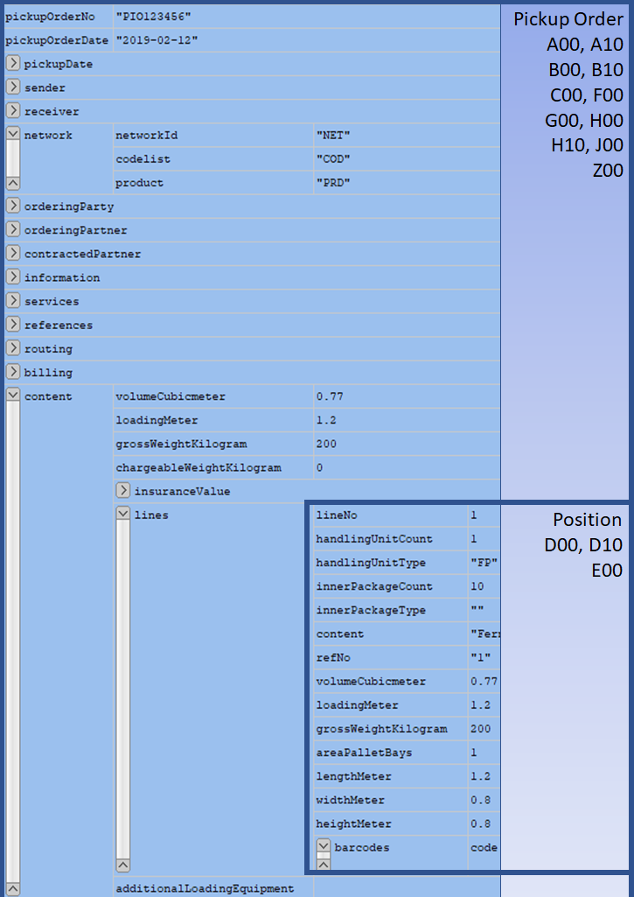

<div style="text-align: center;">
	<h1>Mapping Guideline for FORTRAS BORD512 to conizi pickup order format</h1>
	<strong>v1.1 - 2019-MAY-17</strong>
</div>


## Introduction

This documentation is a part of the Mapping Guideline series for [conizi](https://www.conizi.de) semantic model. The messages described here are used for communicating with conizi applications, such as Track and Trace and Order Management, and other partners connected to the conizi network.

The structure of pickup order and the content of the fields and message parts will be described in this document.

The standard of the source message format is FORTRAS and the version used here is release 100. The message format is often just referred to as REL100.

## Technical Background

The conizi platform processes JSON format objects and their exact format is specified by the [JSON Schema standard, version draft-06](https://json-schema.org/learn/getting-started-step-by-step.html). The schema documentation can be found in a public repository on the https://github.com/conizi/semantic-model URL.

The structures of the conizi manifest and status business objects are specified by the files under model/transport/truck/groupage/forwarding folder.

The order of elements in JSON format message does not matter - as opposed to FORTRAS and XML format files.

The countries must be specified with their 2 characters long Alpha-2 ISO-3166 standard codes, which can be found here: https://en.wikipedia.org/wiki/List_of_ISO_3166_country_codes

The dates in JSON files are always in YYYY-MM-DD format as described by ISO-8601 standard.

## FORTRAS BORD512 Message Structure

FORTRAS messages consist of records and each record type has a different set of fields. Each record and each field inside the records was given an id or a name. In this mapping documentation we will refer to the records and fields by their ids and names.

Please refer to [Appendix 1.](#appendix-1-fortras-rel100-bord512-record-references) for the list of record ids and [Appendix 2.](#appendix-2-fortras-rel100-bord512-field-references) for field names.

The FORTRAS standard allows creating custom records on row type id 99 (e.g.: D99). These records are not in the scope of this mapping documentation.

## Conizi Pickup Order Message Overview

The conizi pickup order message consists of 2 levels: pickup order (consignment), position. The drawing below shows how the parts are related to each other and what is the connection between them and the FORTRAS message records.



Please also refer to [Appendix 3.](#appendix-3-sample-conizi-format-manifest-file), where a complete conizi format pickup order file can be found. This is how the result of the conversion, mapping should look like in JSON format.

The schema must be referenced from each level of the message. To better understand this concept, check for the $schema tags in the [Appendix 3.](#appendix-3-sample-conizi-format-manifest-file).

The following schema references must be added for different message sections, levels:

|Message section / level|schema reference|
|----|----|
|pickuporder level|https://raw.githubusercontent.com/conizi/semantic-model/master/transport/truck/groupage/forwarding/pickuporder|
|pickuporder bulk level|https://raw.githubusercontent.com/conizi/semantic-model/master/transport/truck/groupage/forwarding/pickuporder-bulk|
|consignment|https://raw.githubusercontent.com/conizi/semantic-model/master/transport/truck/groupage/forwarding/consignment|

## Mapping

In the mapping description we use the path notation to refer to source and target fields. Source field path consists of the record type and the field of that record. Eg.: A00/waybillNumber

There are some fields in the documentation starting with "x-". These are temporary fields that are currently working, but are subject to change in the near future. These fields are not included in the schema.

### Pickup Order Level

This is the main level of the pickup order message. For each BORD512 file this is mapped only once.

One pickup order message can contain only one consignment, starting with B00 (address) record.

So the pickup order level is also the consignment level as opposed to manifest file format, where a manifest can contain multiple consignments.

The pickup order and the consignment is described by these record types: A00, B00, B10, C00, D00, D10, E00, E10, F00, G00, H00, H10 and I00.

The lines/lineNo field should be filled with sequentialWaybillItem of the given consignment. This value is the same for each FORTRAS record of the consignment and can be taken from any record type inside the consignment level. 

| conizi pickup order field | FORTRAS BORD512 field         | Description |
|-------------------------------|-------------------------------|-------------|
|pickupOrderNo                     |G00/consignmentNumberSendingDepot|**Mandatory.** Unique identification for the pickup order within the transport management system of the ordering / contracting partner|
|pickupOrderDate                   |A00/waybillDate|**Mandatory.** The date on which the pickup order was sent from ordering partner to contracted partner.|
|pickupDate/date                  |G00/pickupDate|**Mandatory.** The date on which the pickup order should be processed by the contracted partner.|
|pickupDate/timeFrom |G00/pickupTimeFrom||
|pickupDate/timeUntil |G00/pickupTimeTo||
|sender/ediId                         |header/senderId|The sender of the current record. This usually equals to the ordering party unless the record is a copy that was generated by some other component. In this case the sender can be different from the ordering party|
|receiver/ediId                       |header/receiverId|The intended recipient / contracted party of the the current record. This usually equals to the shipping party unless the record is intentionally sent to another system.|
|network/product                        |A00/product|The product allows to distingish different processes within one network, effectively sub classing the network.|
|network/networkId |Network id assigned by conizi for the given business case.|The name of the network. This is often identical to the name of the code list. Since the same code list may however be used outside the network, this field independently allows to specify the network.|
|additionalPartners             |See [Address Mapping](#address-mapping)|Additional partners which are also involved in processing this pickup order|
|orderingParty/partnerId                |B00/addressTypeQualifier = ORD<br />See [Address Mapping](#address-mapping)|**Mandatory.** Person or company that ordered the pickup. Often identical to the receiver of the goods|
|orderingPartner/partnerId               |A00/waybillConsignorId|The partner which is sending the pickup order to the contracted partner for pickup.|
|contractedPartner/partnerId                        |A00/waybillConsigneeId|**Mandatory.** The partner which is receiving the pickup order from the ordering partner for pickup.|
|services|See [Services Mapping](#services-mapping) and [Text Codes](#text-codes)|Special services which can be requested by the ordering party (or the ordering partner).|
|routing|See [Routing Mapping](#routing-mapping)|Information about the route taken by this consignment|
|information|See [Information Mapping](#information-mapping)|General information about the pickup order|
|references|See [References Mapping](#references-mapping)|Numbers of various sources identifing this pickup order or references from this pickup to other business processes|
|billing|See [Billing Mapping](#billing-mapping)|Information for invoicing and clearing|
|customsInformation|See [Customs Information Mapping](#customs-information-mapping)|Used to specifiy information necessary in the customs process|
|content|See [Pickup Order Content Mapping](#pickup-order-content-mapping)|Describes the nature and quantity of the goods in this pickup order|


#### Address Mapping

Addresses are mapped from different qualifier B00 / B10 records. The main address data is coming from B00 and the contact information is added from further B10 records.

| conizi manifest field         | FORTRAS BORD512 field         | Notes |
|-------------------------------|-------------------------------|-------------|
|name|B00/name1||
|x-name2|B00/name2||
|x-name3|B00/name3||
|street|B00/streetAndStreetNumber||
|countryCode|B00/countryCode||
|zipCode|B00/postcode||
|city|B00/place||
|townArea|B00/townArea||
|reference|B00/partnerId||
|contactPerson|B10/content from B10 record, where communicationTypeQualifier = KPE|Can be more, separated by comma.|
|phoneNumber|B10/content from B10 record, where communicationTypeQualifier = TEL|Can be more, separated by comma.|
|emailAddress|B10/content from B10 record, where communicationTypeQualifier = EMA|Can be more, separated by comma.|
|faxNumber|B10/content from B10 record, where communicationTypeQualifier = FAX|Can be more, separated by comma.|

#### Routing Mapping

Fields discussed in this chapter are all under the */routing* path.

|conizi manifest field|FORTRAS BORD512 field|Description|
|----|----|----|
|shipper|B00/addressTypeQualifier = SHP<br />See [Address Mapping](#address-mapping)|The address of the party which is sending the goods. This is usually the place where the transport originated|
|consignee|B00/addressTypeQualifier = CON<br />See [Address Mapping](#address-mapping)|The address of the good's recipient|

#### Services Mapping

Fields discussed in this chapter are all under the */services* path.

The majority of the services element mapping is done from the H00 text code, see [Text Codes](#text-codes).

|conizi manifest field|FORTRAS BORD512 field|Description|
|----|----|----|
|notifications/generalNotificationAddress|B00/addressTypeQualifier = NOT<br />See [Address Mapping](#address-mapping)|An address and associated contact information which should be kept in the loop|
|anonymity||Neutral addresses which are shown to the shipper or consignee in order to conceal the actual shipper or recipient of the goods.|
|anonymity/neutralShipper|B00/addressTypeQualifier = NES<br />See [Address Mapping](#address-mapping)|An address to be shown to the consignee instead of the actual shipper when delivering the goods|
|anonymity/neutralConsignee|B00/addressTypeQualifier = NEC<br />See [Address Mapping](#address-mapping)|An address to be shown to the shipper instead of the actual address the consignee when picking up the goods|
|services/unloadingOptions/directDelivery|if G00/directDelivery = 'Y', then true|The goods are to be delivered without unloading them at the receiving partners warehouse|
|services/loadingOptions/receivingPartnerDisposal|B00/addressTypeQualifier = DLF<br />See [Address Mapping](#address-mapping)|The partner which should get the goods after pickup from the contracted partners. If not set the receiving partner usually is determined by the networks routing rules.|
|services/loadingOptions/gatewayDisposal||The gateway / HUB to which the goods should send after pickup from the contracted partners. If not set the route usually is determined by the networks routing rules.|


#### Information Mapping

Fields discussed in this chapter are all under the */information* path.

|conizi manifest field|FORTRAS BORD512 field|Description|
|----|----|----|
|remarksGeneral|H10/text, where textQualifier = '000'|Free text information|
|remarksDelivery|H10/text, where textQualifier = '001'|Free text information for the delivery|
|remarksPickup|H10/text, where textQualifier = '002'|Free text information for the pick up|
|remarksInvoice|H10/text, where textQualifier = '003'|Free text information for the invoice|

#### References Mapping

Fields discussed in this chapter are all under the */references* path.

All of these fields are usually mapped from H00 text codes. See [Text Codes](#text-codes).

#### Billing Mapping

Fields discussed in this chapter are all under the */billing* path.

|conizi manifest field|FORTRAS BORD512 field|Description|
|----|----|----|
|freightPayer|B00/addressTypeQualifier = INV<br />See [Address Mapping](#address-mapping)|The party which receives the invoice (if different from the shipper).|
|tariff||Use to specify a special tariff to be used for freight calculation (e.g. heavy goods, ...)|
|deliveryTerms|G00/deliveryTerm|Use to specify under which terms the consignment followed by this pickup order is processed and which legs are billed to whom|
|logisticModel|G00/logisticsModel|Used to active special billing and clearing conditions the partners have agreed on|

#### Customs Information Mapping

Fields discussed in this chapter are all under the */customsInformation* path.

|conizi manifest field|FORTRAS BORD512 field|
|----|----|
|clearedForFreeTransitWithinEU|See [Text Codes Mapping](#text-codes)|
|valueAtBorderCrossing/amount|C00/transitValue|
|valueAtBorderCrossing/currency|C00/transitValueCurrency|
|cityUnloading|C00/pointOfDelivery|
|customsOffice|C00/customsOffice|
|customsProcess|C00/customsProcedure|
|customsType|C00/dutyPaymentType|
|importCustomsOffice|C00/customsOfficeEntry|
|parentDocumentId|C00/precedingDocumentNumber|
|parentDocumentType|C00/precedingDocumentType|
|routeBorder|C00/modeOfTransportToBorder|
|routeInland|C00/domesticModeOfTransport|
|statisticsFlag|C00/statisticsStatus|
|transferType|C00/businessType|
|countryConsignor|C00/consignorCountry|
|countryImporter|C00/countryOfImporter|
|countryLoading|C00/countryOfLoading|
|countryOfOrigin|C00/countryOfOrigin|
|countryUnloading|C00/destinationCountry|
|documents/type|A documents tag must be created for each C00/appendix... group. <br />C00/appendixType|
|documents/number|C00/appendixNumber|
|documents/date|C00/appendixDate|

#### Pickup Order Content Mapping

Fields discussed in this chapter are all under the */content* path.

|conizi manifest field|FORTRAS BORD512 field|Description|
|----|----|----|
|nonHazardousWaste|See [Text Codes Mapping](#text-codes)|The content has no value and is not dangerous|
|loadingAids|See [Text Codes Mapping](#text-codes)|The pickup only consists of loading aids which are picked up and does not contain real goods|
|highValueGoods|G00/materialGroup = 002 or from <br/>See also [Text Codes Mapping](#text-codes)| This pickup contains goods of high value which are subject to higher insure fees and a higher risk of theft |
|highConsequencesDangerousGoods|See [Text Codes Mapping](#text-codes)| This pickup contains dangerous goods which must be handeled unter the terms of HCDG |
|insuranceValue/amount|G00/goodsValue<br/>See also [Text Codes Mapping](#text-codes)|Value of the goods, used for insurance purposes|
|insuranceValue/currency|G00/currencyOfGoodsValue||
|volumeCubicmeter|G00/cubicMeters|Total volume of the consignment|
|loadingMeter|G00/loadingMeters|Length of the area occupied on a 2.4 m wide container|
|grossWeightKilogram|G00/actualConsignmentGrossWeightInKg| Weight of the pickup order including all packaging           |
|areaPalletBays|G00/numberOfPalletLocations| Area used by the pickup order in terms of standard EUR pallet bays (120 x 80 cm) |
|chargeableWeightKilogram|G00/chargeableConsignmentWeightInKg| Virtual weight of the shipment used for billing purposes. Used to take the bulkiness of goods into account or to enforce minimums. |
|lines|See [Position Level](#position-level) Mapping|Lines are describing handling units of similar sizes and content for brevity|

### Position Level

Fields discussed in this chapter are all under the */content/lines* path. The lines tag contains an array of objects of which these fields are members of. 

|conizi manifest field|FORTRAS BORD512 field|Description|
|----|----|----|
|lineNo|D00/consignmentPosition|A ordinal number, ordering the line within the consignment|
|handlingUnitCount|D00/numberOfPackages|The number of the items in this consignment which are handeled individually|
|handlingUnitType|D00/packagingType|The type of packaging (e.g. pallet, carton box, ...) ouf the outer most packaging|
|innerPackageCount|D00/numberOfPackagesOnPallets|Used to specify the number of inner packages (e.g. the number of boxes on a pallet)|
|innerPackageType|D00/packagingTypeOnPallets|The type of packaging of the inner packages|
|content|D00/contentOfGoods|A short description of the nature of the goods contained within the packages|
|refNo|D00/codeAndNumber|A reference of the ordering party relating to the goods|
|volumeCubicmeter|D00/cubicMeters|Total volume of the line|
|loadingMeter|D00/loadingMeters|Length of the area occupied on a 2.4 m wide container|
|grossWeightKilogram|D00/actualWeight|Weight of the line including all packaging|
|areaPalletBays|D00/numberOfPalletLocations|Area used by the line in terms of standard EUR pallet bays (120 x 80 cm)|
|chargeableWeightKilogram|D00/chargeableWeight|Virtual weight of the line used for billing purposes. Used to take the bulkiness of goods into account or to enforce minimums.|
|lengthMeter|D00/lengthInMeters|Total length of the line|
|widthMeter|D00/widthInMeters|Total width of the line|
|heightMeter|D00/heightInMeters|Total height of the line|
|customsInformation|See [Position Level Customs Information Mapping](#position-level-customs-information-mapping)|Used to specifiy information necessary in the customs process|
|barcodes|See [Barcodes Mapping](#barcodes-mapping)|Detailed information about the individual handling units|
|dangerousGoods|See [Dangerous Goods Information](#dangerous-goods-information)|Detailed information about dangerous goods and the danger types|

#### Position Level Customs Information Mapping

Fields discussed in this chapter are all under the */content/lines/customsInformation* path. 

|conizi manifest field|FORTRAS BORD512 field|
|----|----|
|goodsNo|D10/productNumber|
|processCode|D10/procedureCode|
|netweightKilogram|D10/fixedLoadInKgNet|
|rawWeightKilogram|D10/rawMassInKg|
|countryOfOrigin|D10/countryOfOrigin|
|customsValue/amount|D10/customsValue|
|customsValue/currency|D10/currencyOfCustomsValue|
|statisticalValue/amount|D10/statisticalValue|
|statisticalValue/currency|D10/currencyOfStatisticalValue|
|documents/type|A documents tag must be created for each D10/appendix... group. <br />D10/appendixType|
|documents/number|D10/appendixNumber|
|documents/date|D10/appendixDate|

#### Barcodes Mapping

Fields discussed in this chapter are all under the */content/lines/barcodes* path. The barcodes tag contains an array of objects of which these fields are members of. An array element must be created for each F00 record.

|conizi manifest field|FORTRAS BORD512 field|Description|
|----|----|----|
|code|F00/barcode|Id of the handling unit, usually printed as machine readable bar code on the package|
|masterBarcode||Grouping of multiple packages|
|batch||Information identifying the manufacturing batch of the goods in the unit|
|bestBefore||Information about the expiry of goods|

#### Dangerous Goods Information

Fields discussed in this chapter are all under the */content/lines/dangerousGoods* path. The dangerousGoods tag contains an array of objects of which these fields are members of. An array element must be created for each E00 record.

|conizi manifest field|FORTRAS BORD512 field|
|----|----|
|quantity|E00/numberOfPackages|
|grossWeightKilogram|E00/grossWeightInKg|
|unNo|E00/unNumber|
|multiplier|E00/multiplier|
|uniqueKey|E00/uniqueKey|
|substanceName|E00/materialNameDangerousGoodsDesc|
|labelMainRisk|E00/dangerousGoodsSampleMajor|
|labelSubRisk1|E00/dangerousGoodsSampleMinor1|
|labelSubRisk2|E00/dangerousGoodsSampleMinor2|
|labelSubRisk3|E00/dangerousGoodsSampleMinor3|
|packagingDescription|E00/descriptionOfPackaging|
|netExplosiveMassKilogram|E00/netExplosiveMassInKg|
|transportCategory|E00/transportClass|
|limitedQuantity|E00/limitedAmount<br/>See also [Text Codes](#text-codes).|
|totalPointsADR|E00/calculatedDangerousGoodsPoints|
|tunnelRestriction|E00/tunnelLimitationCode|
|packagingGroup|E00/packagingGroup|
|classificationCode|E00/classificationCode|
|exemptedQuantity|E00/exemptQuantity|
|netWeightKilogram|if E00/qualifierForLitersOrNetWeight = NGW then E00/entryForLitersOrNetWeightInKg else empty|
|volumeLiter|if E00/qualifierForLitersOrNetWeight = LIT then E00/entryForLitersOrNetWeightInKg else empty|
|adrRelease|E00/ggRelease|
|packagingClass|E00/packagingGroupClassification|
|references/fireworksBamNo||
|x-additionalTextForNAG|E00/additionalTextForNAG|


## Text Codes

The H00 records in the FORTRAS manifest messages provides very flexible data transfer possibilities. Using these fields a partner can specify its own coding standard to include arbitrary information about the consignment in the message.

In FORTRAS standard H00 records belong to the consignment level and mapped into the conizi pickup order message on consignment level too, with a very rare exception.

In this chapter we list the fields that can be mapped from H00 fields. The structure and the usage of H00/additionalText fields must be specified by the partner and used in the mapping to provide the necessary consignment data .

### Content Fields

The conizi manifest tags are below */content*. This root path won't be repeated for each item in the table.

| Manifest field  | Description |
|-------------|-------------|
|nonHazardousWaste|The content has no value and is not dangerous|
|highValueGoods|This consignment contains goods of high value which are subject to higher insure fees and a higher risk of theft|
|insuranceValue/amount|Value of the goods, used for insurance purposes|
|lines/dangerousGoods/limitedQuantity||

### Service Fields

The conizi manifest tags are below */services*. This root path won't be repeated for each item in the table.

| Manifest field  | Description |
|-------------|-------------|
| ***pickupOptions*** | Special services which can be requested by the ordering party (or the ordering partner). |
| liftingPlatform | The pickup order can only be picked up with a vehicle equipped with a lifting platform |
| deliveryNoteFollowingByPost | Delivery Note is following later by post or driver post. |
| emptyPallets | Driver has to bring empty pallets for exchange. |
| unknownDangerousGoods | The pickup contains unknown dangerous goods. |
| pointOfUsePickup1Person | The goods must be picked up from the point of use with one man handling. Usually in case of returning old goods. |
| pointOfUsePickup2Persons | The goods must be picked up from the point of use with two man handling. Usually in case of returning old goods. |
| useSpecificLastMileProvider/name | A given last mile provider must be used |
| forAttentionOf | The pickup is for attention of the given company |
| ***packagingOptions*** |  |
|packagingOptions/return|Packaging material return|
|packagingOptions/correction|Packaging correction for your Bordero from: ... (Additional description)|
|packagingOptions/thirdPartyDelivery|Delivery of packaging by third parties on: ... (Additional description)|
|packagingOptions/pickup|Package pickup|
|***specialRun***|The transport is produced via special run (and with special fares)|
|***notifications***|*Notifications which should be sent while processing the shipment, e.g. notifications about successful delivery, advance notifications, ...*|
|notifications/generalNotificationAddress|An address and associated contact information which should be kept in the loop|
|notifications/beforePickup|Before a pickup is attempted the address noted here should be contacted within the given time frame. See [Address Mapping](#address-mapping).|
|notifications/afterPickup|Information about successful pickup should be given to this address. See [Address Mapping](#address-mapping).|
|notifications/afterDelivery|Information about successful delivery should be given to this address. See [Address Mapping](#address-mapping).|
|notifications/beforeDelivery|Before a delivery is attempted the person noted here should be contacted within the given time frame. See [Address Mapping](#address-mapping).|
|notifications/byDriver|The driver should call the given contact before delivery. See [Address Mapping](#address-mapping).|
|notifications/byDriverBeforePickup|The driver should call the given contact before pickup. See [Address Mapping](#address-mapping).|
|***timeSlotBooking***|*Information about time slots which need to be booked or are already booked for this consignment*|
|timeSlotBooking/byDeliveringPartner|A time slot must be booked by the delivering partner before making a delivery attempt.|
|timeSlotBooking/byContractedPartner|A time slot must be booked by the contracted partner before making the pickup attempt.|
|timeSlotBooking/preBookedTimeslot|A time slot has already been booked for the delivery of this consignment. Delivery must be attempted within this time slot.|
|***timeOptions***|*Requirements for the delivery or pickup time*|
|timeOptions/notAfter/date|The consignment must be delivered until the given date|
|timeOptions/notBefore/date|The consignment must not be delivered before the given date|
|timeOptions/fixedDay/date (timeFrom, timeUntil)|The consignment must be delivered at the given date (and in the given time window).|
|timeOptions/fixedWeek/year, weekOfYear|The consignment must be delivered within the given week of the year|
|timeOptions/weekendSaturday/timeFrom, timeUntil|The consignment should be delivered on a Saturday|
|timeOptions/nextDay/timeFrom, timeUntil|The consignment must be delivered on the next working day|
|timeOptions/sameDay/timeFrom, timeUntil|The consignment must be delivered on the same day|
|timeOptions/evening/timeFrom, timeUntil|The consignment must be delivered in the evening hours|
|timeOptions/sameDayPickup/timeFrom, timeUntil|The goods must be picked up on the same day|
|***deliveryOptions***|Requirements for special services or equipment for the delivery|
|deliveryOptions/liftingPlatform|The consignment can only be delivered with a vehicle equipped with a lifting platform|
|deliveryOptions/pointOfUseDelivery1Person|The goods must be delivered to the point of use with one man handling|
|deliveryOptions/pointOfUseDelivery2Persons|The goods must be delivered to the point of use with two man handling|
|deliveryOptions/shelfService|The goods must be put into the shelves at the destination|
|deliveryOptions/useSpecificLastMileProvider|A given last mile provider must be used|
|deliveryOptions/cashOnDelivery|The goods must only be delivered if the recipient pays the given amount|
|deliveryOptions/cashOnDelivery/amount|The amount to be paid|
|deliveryOptions/cashOnDelivery/currency|The currency of the given amount|
|deliveryOptions/cashOnDelivery/acceptCash|Specifies if cash should be accepted (true) or rejected (false).|
|deliveryOptions/cashOnDelivery/acceptCheque|Specifies if cheques should be accepted|
|deliveryOptions/pickupByConsignee|The consignee will pick up the goods at the receiving partner's warehouse. Do not perform local delivery.|
|deliveryOptions/workRequest/info|The receiving partner should perform the action specified|
|deliveryOptions/deliveryOnlyWithDeliveryNote|Delivery should only be performed with the delivery note.|
|deliveryOptions/returnOriginalDeliveryNote|Original delivery note must be returned with the signature of the recipient to the shipping partner as paper (i.e. not in electronic form).|
|deliveryOptions/digitalDeliveryNote|The delivery note has been sent by means of digital communication (and is not attached to the goods)|
|deliveryOptions/deliveryNoteOnGoods|The delivery note is attached to the goods|
|deliveryOptions/podOnOriginalDeliveryNote|The recipient must sign the original delivery note as proof of delivery. The signed document must be returned to the shipping partner.|
|deliveryOptions/deliveryWithoutReceiptAllowed|The goods may be dropped at the designated location without a signature|
|deliveryOptions/forAttentionOf|The delivery is for attention of the given company|
|***loadingOptions***|Information about the loading of the main haul|
|loadingOptions/directPickup|The goods picked up by the line haul and are not loaded by the shipping partners warehouse|
|***unloadingOptions***||
|unloadingOptions/directDelivery|The goods are to be delivered without unloading them at the receiving partners warehouse|
|***gateway***|Special requirements for the handling of the goods at intermediate hubs / gateways|
|gateway/priority|The consignment must be processed with priority|
|***handlingInstructions***|Handling instructions for the goods, e.g. to prevent damage|
|handlingInstructions/customsGoods|The goods are subject to customs processing and must be processed according the rules of the local authorities|
|handlingInstructions/handleWithCare|The goods must be handled with care to prevent damage|
|handlingInstructions/orientation (/vertical, /horizontal)|The goods must be transported in a given orientation and may not be flipped over|
|handlingInstructions/stacking (/allowed, /forbidden)|Indicated whether the goods may or may not be stacked|
|handlingInstructions/temperatureRestrictions (/temperatureMinCelsius, /temperatureMaxCelsius)|Restrictions about the minimum and maximum temperature during the transport and special equipment to be used|
|handlingInstructions/food/haccp|The HACCP regulations apply|
|***returnOfGoods***|Services for the return of goods|
|returnOfGoods/emptyPackaging|The packaging of the goods is taken back and disposed|

### References Fields

The conizi manifest tags are below */references*. This root path won't be repeated for each item in the table.

| Manifest field  | Description |
|-------------|-------------|
|returnOfPreviousConsignment|Reference to another consignment which content is return using this pickup order|
|subsequentDelivery|Additional delivery to our Bordero from: ... (additional text) (Shipment-no. of the dispatching and receiving partner are to be transferred additionally)|
|subsequentDelivery/consignmentNoShippingPartner|The consignment number of the original consignment|
|subsequentDelivery/shippingDate|The date when the original shipment was forwarded|
|subsequentDelivery/shippingPartner|The partner which originally forwarded the consignment|
|deliveryNote|The delivery note of the shipper which describes the content of this pickup order|
|customerOrderNo|A reference of the shipper for this consignment|
|customerOrderDate|Date when the order was placed with the shipping partner|
|orderEntrySystemReference|A unque reference number from the system which was used to enter the order details|

### CustomsInfo fields

The conizi manifest tags are below */customsinfo*. This root path won't be repeated for each item in the table.

| Manifest field  | Description |
|-------------|-------------|
|clearedForFreeTransitWithinEU| |

## Appendix 1. FORTRAS REL100 BORD512 Record References

We only include the information here that is necessary to find the fields in the originating message referenced by the mapping documentation. Describing the BORD message format in detail is outside of the scope of this documentation.

Each data record begins with a short id which declares its type. The record type ids are listed in the table with the  short description of their contents.

| Record type  | Description |
|-------------|-------------|
| @@PH | Header record. Referenced as "header" in the mapping documentation. |
| A00 | Consignment data head |
| A10 | Loading unit |
| B00 | Addresses |
| B10 | Communication information |
| C00 | Customs information |
| D00 | Consignment positions |
| D10 | Customs information for the item |
| E00 | Dangerous goods record |
| E10 | Additional texts for E00 |
| F00 | Barcodes and references |
| G00 | Consignment sums |
| H00 | Text codes |
| H10 | Individual texts |
| I00 | Service types |
| J00 | Consignment data sums |
| Z00 | Control record |
| @@PT | Trailer record |


## Appendix 2. FORTRAS REL100 BORD512 Field References

In the following chapters each field will be identified and labeled with a unique tag, so that they can be located unambiguously inside the BORD512 format file. These tags later will be used in the mapping section as paths for the incoming data.

In the table we specify the length of the field and the place where their data begins according to the FORTRAS REL100 standard.

Repeating fields are not listed multiple times for sake of brevity. In name of these items we always denote the place of the numbering with "[n]" and "[m]" (if multiple numbering is used). Eg.:
leadSealNumber1LU1, leadSealNumber1LU2, leadSealNumber1LU3, leadSealNumber1LU4
will be just described with leadSealNumber[n]LU[m]

### @@PH - Header Record
|Field reference|Length|From|Notes|
|---------------|------|----|-----|
|recordType|4|1|fix '@@PH'|
|type|7|5|fix 'BORD512'|
|empty|1|12||
|rowLength|4|13|0512|
|empty|2|17|00|
|startAddress|2|19|35|
|empty|2|21|00|
|internalSign|1|23|1|
|empty|1|24|0|
|mailboxLength|2|25|'7 '|
|mailboxSender|x|27|'AAAAAAA'|
| mailboxReceiver      |||Startaddress-(Startadress+Mailbox-Length)|

Examples:

```
@@PHBORD512 0512003500107 AAAAAAA BBBBBBB
```
```
@@PHBORD512 05120044001018LONGSENDERHEADER LONGRECEIVERHEADER
```

### A00 - Consignment Data Head

|Field reference|Length|From|
|---------------|------:|----:|
|recordType|3|1|
|dataType|3|4|
|releaseVersion|3|7|
|waybillNumber|35|10|
|waybillDate|8|45|
|transportType|3|53|
|product|3|56|
|codeList|3|59|
|currency|3|62|
|waybillConsignorId|35|65|
|waybillConsigneeId|35|100|
|freightOperator|35|135|
|freightOperatorCountry|3|170|
|freightOperatorPostcode|9|173|
|freightOperatorTown|35|182|
|vehicleLicenseNumber1|35|217|
|vehicleLicenseNumber2|35|252|
|routingId1|35|287|
|routingId2|35|322|
|testCode|1|357|
|arrivalDate|8|358|
|arrivalTime|4|366|
|arrivalTimeQualifier|3|370|
|trafficType2|3|373|
|driverName|35|376|
|driverPhone|20|411|


### A10 - Loading Unit

|Field reference|Length|From|Notes|
|---------------|------:|----:|--|
|recordType|3|1||
|loadingUnitsNo[n]|35|4|Repeted twice, with the seal numbers|
|leadSealNumber[n]LU[m]|35|39|Repeated 4 times|

#### B00 - Addresses

|Field reference|Length|From|
|---------------|-----:|---:|
|recordType|3|1|
|sequentialWaybillItem|3|4|
|addressTypeQualifier|3|7|
|name1|35|10|
|streetAndStreetNumber|35|45|
|countryCode|3|80|
|postcode|9|83|
|place|35|92|
|partnerId|35|127|
|name2|35|162|
|name3|35|197|
|townArea|35|232|
|globalLocalizationNumber|35|267|
|customsId|35|302|


### B10 - Communication Information
|Field reference|Length|From|
|---------------|-----:|---:|
|recordType|3|1|
|sequentialWaybillItem|3|4|
|communicationTypeQualifier|3|7|
|content|256|10|


### C00 - Customs Information

|Field reference|Length|From|Notes|
|---------------|-----:|---:|----|
|recordType|3|1||
|sequentialWaybillItem|3|4||
|dutyPaymentType|3|7||
|customsProcedure|4|10||
|customsOffice|8|14||
|countryOfOrigin|3|22||
|countryOfLoading|3|25||
|consignorCountry|3|28||
|destinationCountry|3|31||
|destinationLand|3|34||
|countryOfImporter|3|37||
|statisticsStatus|3|40||
|pointOfDelivery|35|43||
|transitValue|9|78||
|transitValueCurrency|3|87||
|businessType|3|90||
|modeOfTransportToBorder|3|93||
|domesticModeOfTransport|3|96||
|customsOfficeEntry|8|99||
|precedingDocumentType|10|107||
|precedingDocumentNumber|25|117||
|appendixType[n]|6|142|Repeating 3 times|
|appendixNumber[n]|20|148||
|appendixDate[n]|8|168||


### D00 - Consignment Positions

|Field reference|Length|From|
|---------------|-----:|---:|
|recordType|3|1|
|sequentialWaybillItem|3|4|
|consignmentPosition|3|7|
|numberOfPackages|4|10|
|packagingType|3|14|
|numberOfPackagesOnPallets|4|17|
|packagingTypeOnPallets|3|21|
|contentOfGoods|35|24|
|codeAndNumber|35|59|
|actualWeight|9|94|
|chargeableWeight|9|103|
|lengthInMeters|4|112|
|widthInMeters|4|116|
|heightInMeters|4|120|
|cubicMeters|5|124|
|loadingMeters|3|129|
|numberOfPalletLocations|4|132|


### D10 - Customs Information for The Item

|Field reference|Length|From|Notes|
|---------------|------:|----:|-----|
|recordType|3|1||
|sequentialWaybillItem|3|4||
|consignmentPosition|3|7||
|productNumber|15|10||
|countryOfOrigin|3|25||
|rawMassInKg|9|28||
|fixedLoadInKgNet|9|37||
|procedureCode|5|46||
|customsValue|11|51||
|currencyOfCustomsValue|3|62||
|statisticalValue|11|65||
|currencyOfStatisticalValue|3|76||
|appendixType[n]|6|79|Repeated 4 times|
|appendixNumber[n]|20|85||
|appendixDate[n]|8|105||


### E00 - Dangerous Goods Record

|Field reference|Length|From|
|---------------|-----:|---:|
|recordType|3|1|
|sequentialWaybillItem|3|4|
|consignmentPosition|3|7|
|ggRelease|3|10|
|numberOfPackages|4|13|
|grossWeightInKg|9|17|
|unNumber|4|26|
|descriptionOfPackaging|35|30|
|multiplier|4|65|
|ggDatabaseId|3|69|
|uniqueKey|10|72|
|materialNameDangerousGoodsDesc|210|82|
|additionalTextForNAG|7|292|
|dangerousGoodsSampleMajor|3|362|
|dangerousGoodsSampleMinor1|3|365|
|dangerousGoodsSampleMinor2|3|368|
|dangerousGoodsSampleMinor3|3|371|
|packagingGroupClassification|4|374|
|netExplosiveMassInKg|9|378|
|transportClass|1|387|
|limitedAmount|1|388|
|calculatedDangerousGoodsPoints|9|389|
|tunnelLimitationCode|6|398|
|packagingGroup|4|404|
|classificationCode|4|408|
|exemptQuantity|1|412|
|entryForLitersOrNetWeightInKg|9|413|
|qualifierForLitersOrNetWeight|3|422|
|harmfulToTheEnvironment|1|425|


### E10 - Additional Texts for E00
|Field reference|Length|From|Notes|
|---------------|-----:|---:|----|
|recordType|3|1||
|sequentialWaybillItem|3|4||
|consignmentPosition|3|7||
|textQualifier[n]|70|10|Repeated 5 times|
|text[n]|3|13||

### F00 - Barcodes and References
|Field reference|Length|From|Notes|
|---------------|-----:|---:|----|
|recordType|3|1||
|sequentialWaybillItem|3|4||
|consignmentPosition|3|7||
|barcode|35|10||
|referenceQualifier|3|45|Repeating 5 times. Not numbered!|
|referenceNumber|35|48||

### G00 - Consignment Sums
|Field reference|Length|From|
|---------------|-----:|---:|
|recordType|3|1|
|sequentialWaybillItem|3|4|
|consignmentNumberSendingDepot|35|7|
|actualConsignmentGrossWeightInKg|9|42|
|deliveryTerm|3|51|
|directDelivery|1|54|
|pickupDate|8|55|
|pickupTimeFrom|4|63|
|pickupTimeTo|4|67|
|logisticsModel|6|71|
|consignmentNumberReceivingDepot|35|77|
|consignorIdOriginalWaybill|35|112|
|consigneeIdOriginalWaybill|35|147|
|materialGroup|3|182|
|goodsValue|11|185|
|currencyOfGoodsValue|3|196|
|chargeableConsignmentWeightInKg|9|199|
|cubicMeters|5|208|
|loadingMeters|3|213|
|numberOfPalletLocations|4|216|
|numberOfAdditionalLoadingTools1|2|220|
|packagingTypeForAdditionalLoadingTools1|3|222|
|numberOfAdditionalLoadingTools2|2|225|
|packagingTypeForAdditionalLoadingTools2|3|227|
|directPickupCode|1|230|
|orderDate|8|231|


### H00 - Text Codes
|Field reference|Length|From|Notes|
|---------------|-----:|---:|----|
|recordType|3|1||
|sequentialWaybillItem|3|4||
|textCode[n]|3|7|Repeted 6 times|
|additionalText[n]|35|10||

### H10 - Individual Texts
|Field reference|Length|From|Notes|
|---------------|-----:|---:|----|
|recordType|3|1||
|sequentialWaybillItem|3|4||
|textQualifier[n]|3|7|Repeated 3 times|
|text[n]|70|10||


### I00 - Service Types
|Field reference|Length|From|Notes|
|---------------|-----:|---:|----|
|recordType|3|1||
|sequentialWaybillItem|3|4||
|serviceType[n]|3|7|Repeated 10 times|
|taxCode[n]|1|10||
|amount[n]|9|19||

### J00 - Consignment Data Sums
|Field reference|Length|From|
|---------------|-----:|---:|
|recordType|3|1|
|totalNumberOfConsignments|3|4|
|totalNumberOfPackages|6|7|
|actualGrossWeightInKg|9|13|
|numberOfBoxPallets|4|22|
|numberOfEuroFlatPallets|4|26|
|numberOfAdditionalLoadingToolsFP|4|30|
|numberOfAdditionalLoadingToolsBP|4|34|
|totalsTaxable|11|38|
|totalsNotTaxable|11|49|
|totalsOfProductValueCOD|11|60|
|totalsOfCustoms|11|71|
|totalsOfImportTurnoverTax|11|82|
|totalsOfValueAddedTax|11|93|

### Z00 - Control Record
|Field reference|Length|From|
|---------------|-----:|---:|
|recordType|3|1|
|recordNumber|6|4|
|dateOfCreation|8|10|
|timeOfCreation|6|18|

### @@PT - Trailer Record

Contains no data.

## Appendix 3. Sample Conizi Format Manifest File

The below sample conizi format manifest message was created based on a real life sample. All the addresses, company names, ids, reference numbers were replaced with random / sample values.

This sample can be used to get a hint on how the resulting file should look like after the conversion from FORTRAS format. 

### Single pickup order

```json
{
    "$schema" : "https:\/\/raw.githubusercontent.com\/conizi\/semantic-model\/master\/transport\/truck\/groupage\/forwarding\/pickuporder",
	"pickupOrderNo": "PIO123456",
	"pickupOrderDate": "2019-02-12",
	"pickupDate": {
		"date": "2019-03-10",
		"timeFrom": "10:00:00",
		"timeUntil": "12:30:00"
	},
	"sender": {
		"ediId": "9998"
	},
	"receiver": {
		"ediId": "9999"
	},
	"network": {
		"networkId": "NET",
		"codelist": "COD",
		"product": "PRD"
	},
	"orderingParty": {
		"name": "Auftraggeber ABH",
		"street": "Hauptstraße 1",
		"countryCode": "DE",
		"zipCode": "10119",
		"city": "Berlin",
		"townArea": "",
		"referenceNumber": "9",
		"emailAddress": "eqr@fsdf"
	},
	"orderingPartner": {
		"partnerId": "1234"
	},
	"contractedPartner": {
		"partnerId": "4321"
	},
	"information": {
		"remarksDelivery": ["ANMERKUNGEN ZUR LIEFERUNG:",
		"ANMERKUNGEN ZUR LIEFERUNG:"],
		"remarksPickup": ["ANMERKUNGEN ZUR ABHOLUNG"]
	},
	"services": {
		"timeOptions": {
			"fixedDay": {
				"date": "2019-03-10"
			}
		},
		"deliveryOptions": {
			"cashOnDelivery": {
				"acceptCash": true
			}
		}
	},
	"references": {
		"deliveryNote": "456",
		"customerOrderNo": "123"
	},
	"routing": {
		"shipper": {
			"name": "Versender",
			"street": "Hauptstraße 1",
			"countryCode": "DE",
			"zipCode": "10119",
			"city": "Berlin",
			"referenceNumber": "10",
			"faxNumber": "0261850"
		},
		"consignee": {
			"name": "Empfänger",
			"street": "Hauptstraße 1",
			"countryCode": "DE",
			"zipCode": "10119",
			"city": "Berlin",
			"townArea": "",
			"referenceNumber": "3",
			"phoneNumber": "2680891"
		}
	},
	"billing": {
		"deliveryTerms": "0"
	},
	"content": {
		"volumeCubicmeter": 0.77,
		"loadingMeter": 1.2,
		"grossWeightKilogram": 200,
		"chargeableWeightKilogram": 0,
		"insuranceValue": {
			"amount": 200,
			"currency": "EUR"
		},
		"lines": [{
            "$schema" : "https:\/\/raw.githubusercontent.com\/conizi\/semantic-model\/master\/transport\/truck\/groupage\/forwarding\/consignment",
			"lineNo": 1,
			"handlingUnitCount": 1,
			"handlingUnitType": "FP",
			"innerPackageCount": 10,
			"innerPackageType": "",
			"content": "Fernseher",
			"refNo": "1",
			"volumeCubicmeter": 0.77,
			"loadingMeter": 1.2,
			"grossWeightKilogram": 200,
			"areaPalletBays": 1,
			"lengthMeter": 1.2,
			"widthMeter": 0.8,
			"heightMeter": 0.8,
			"barcodes": [{
				"code": "003999999990000000210"
			}]
		}],
		"additionalLoadingEquipment": {
			
		}
	}
}
```

### Bulk pickup order

```json
{
	"$schema": "https://raw.githubusercontent.com/conizi/semantic-model/master/transport/truck/groupage/forwarding/pickuporder-bulk",
	"sender": {
		"ediId": "SENDER"
	},
	"receiver": {
		"ediId": "RECEIVER"
	},
	"network": {
		"networkId": "NET",
		"codelist": "CL",
		"product": "CL"
	},
	"pickuporders": [
		{
			"$schema": "https://raw.githubusercontent.com/conizi/semantic-model/master/transport/truck/groupage/forwarding/pickuporder",
			"pickupOrderNo": "PO321654",
			"pickupOrderDate": "2019-04-26",
			"pickupDate": {
				"date": "2019-04-26",
				"timeFrom": "08:00:00",
				"timeUntil": "14:00:00"
			},
			"sender": {
				"ediId": "SENDER"
			},
			"receiver": {
				"ediId": "RECEIVER"
			},
			"network": {
				"networkId": "NET",
				"codelist": "CL",
				"product": "CL"
			},
			"orderingParty": {
				"name": "TEST LOGISTICS GMBH",
				"street": "MUSTERSTRASSE 45",
				"countryCode": "DE",
				"zipCode": "99999",
				"city": "MUSTERCITY",
				"townArea": "",
				"reference": "REF001"
			},
			"orderingPartner": {
				"partnerId": "9999"
			},
			"contractedPartner": {
				"partnerId": "9998"
			},
			"information": {},
			"services": {
				"loadingOptions": {
					"receivingPartnerDisposal": {
						"partnerId": "9997"
					}
				},
				"timeOptions": {
					"notAfter": {
						"date": "2019-04-30"
					}
				}
			},
			"references": {
				"customerOrderNo": "CORD3214555",
				"x-customerOrderNo2": "513599"
			},
			"routing": {
				"shipper": {
					"name": "TEST GMBH",
					"x-name2": "",
					"x-name3": "",
					"street": "TEST STR. 12",
					"countryCode": "DE",
					"zipCode": "98888",
					"city": "VOLKACH",
					"townArea": "",
					"reference": "REF5081"
				},
				"consignee": {
					"name": "SAMPLE GMBH",
					"x-name2": "",
					"x-name3": "",
					"street": "SAMPLE STR. 2",
					"countryCode": "NL",
					"zipCode": "654987",
					"city": "AMSTERDAM",
					"townArea": "",
					"reference": "REF471",
				}
			},
			"billing": {
				"deliveryTerms": "2"
			},
			"content": {
				"volumeCubicmeter": 0,
				"loadingMeter": 0,
				"grossWeightKilogram": 320,
				"areaPalletBays": 0,
				"chargeableWeightKilogram": 320,
				"insuranceValue": {
					"amount": 0,
					"currency": "EUR"
				},
				"lines": [
					{
						"lineNo": 1,
						"handlingUnitCount": 1,
						"handlingUnitType": "EP",
						"innerPackageCount": 0,
						"innerPackageType": "",
						"content": "SMART TV",
						"refNo": "",
						"volumeCubicmeter": 0,
						"loadingMeter": 0,
						"grossWeightKilogram": 320,
						"areaPalletBays": 0,
						"chargeableWeightKilogram": 320,
						"lengthMeter": 0,
						"widthMeter": 0,
						"heightMeter": 0,
						"barcodes": []
					}
				],
				"additionalLoadingEquipment": {
					"eurPallets": 0,
					"eurBoxes": 0
				}
			}
		},
		{
			"$schema": "https://raw.githubusercontent.com/conizi/semantic-model/master/transport/truck/groupage/forwarding/pickuporder",
			"pickupOrderNo": "PO458787",
			"pickupOrderDate": "2019-04-26",
			"pickupDate": {
				"date": "2019-04-26",
				"timeFrom": "08:00:00",
				"timeUntil": "14:00:00"
			},
			"sender": {
				"ediId": "SENDER"
			},
			"receiver": {
				"ediId": "RECEIVER"
			},
			"network": {
				"networkId": "NET",
				"codelist": "CL",
				"product": "CL"
			},
			"orderingParty": {
				"name": "TEST LOGISTICS GMBH",
				"street": "MUSTERSTRASSE 45",
				"countryCode": "DE",
				"zipCode": "99999",
				"city": "MUSTERCITY",
				"townArea": "",
				"reference": "REF001"
			},
			"orderingPartner": {
				"partnerId": "9999"
			},
			"contractedPartner": {
				"partnerId": "9989"
			},
			"information": {},
			"services": {
				"loadingOptions": {
					"receivingPartnerDisposal": {
						"partnerId": "9997"
					}
				},
				"deliveryOptions": {
					"x-priorityCustomer": true
				},
				"timeOptions": {
					"notAfter": {
						"date": "2019-04-30"
					}
				}
			},
			"references": {
				"customerOrderNo": "CUST-89797",
			},
			"routing": {
				"shipper": {
					"name": "TEST GMBH",
					"x-name2": "",
					"x-name3": "",
					"street": "TEST STR. 12",
					"countryCode": "DE",
					"zipCode": "98888",
					"city": "VOLKACH",
					"townArea": "",
					"reference": "REF5081"
				},
				"consignee": {
					"name": "SAMPLE GMBH",
					"x-name2": "",
					"x-name3": "",
					"street": "SAMPLE STR. 2",
					"countryCode": "NL",
					"zipCode": "654987",
					"city": "AMSTERDAM",
					"townArea": "",
					"reference": "REF471",
				}
			},
			"billing": {
				"deliveryTerms": "2"
			},
			"content": {
				"volumeCubicmeter": 0,
				"loadingMeter": 0,
				"grossWeightKilogram": 40,
				"areaPalletBays": 0,
				"chargeableWeightKilogram": 40,
				"insuranceValue": {
					"amount": 15480,
					"currency": "EUR"
				},
				"lines": [
					{
						"lineNo": 1,
						"handlingUnitCount": 1,
						"handlingUnitType": "EP",
						"innerPackageCount": 0,
						"innerPackageType": "",
						"content": "LAPTOP",
						"refNo": "",
						"volumeCubicmeter": 0,
						"loadingMeter": 0,
						"grossWeightKilogram": 40,
						"areaPalletBays": 0,
						"chargeableWeightKilogram": 40,
						"lengthMeter": 0,
						"widthMeter": 0,
						"heightMeter": 0,
						"barcodes": []
					}
				],
				"additionalLoadingEquipment": {
					"eurPallets": 0,
					"eurBoxes": 0
				}
			}
		}
	]
}
```
